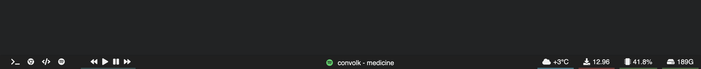

# Bar

Fork of [callahanrts](https://github.com/callahanrts) Bar widget with a few things changed for how I wanted it. I'm using as a system information bar with a small application launcher. 

Bar is an  [Übersicht](https://github.com/felixhageloh/uebersicht) widget
that places a customizable bar on your desktop.

## Elements

- Currently playing music from
  - Spotify
- Media Buttons to control Spotify
- Battery (with charging indicator)
- Date/Time
- Application Launcher
- CPU Usage with indicator
- Disk Space with indicator
- IP Address 
- Download Speed with indicator
- Current weather (temperature / basic weather conditions)

## Installation

Download (or clone) this repository and place the folder in your Übersicht widgets directory.

## Configuration

Open [index.jsx](https://github.com/callahanrts/bar/blob/master/index.coffee)
and edit as you'd like. Some of the objects toward the top should make
customization a little easier.

The download speed and media button components both requre external homebrew packages to work. 

The download speed component require the [speedtest-cli](https://formulae.brew.sh/formula/speedtest-cli) homebew package.

The media buttons require the [shpotify](https://github.com/hnarayanan/shpotify) homebrew package, and then conection to the spotify API.

The weather component uses [wttr.in](https://github.com/chubin/wttr.in) to get weather information. To change the location for weather edit the commands in the scripts/shell.sh file for desired location.

## Questions?

If you find a bug or have any questions about Bar, [submit an issue](https://github.com/callahanrts/bar/issues/new).

